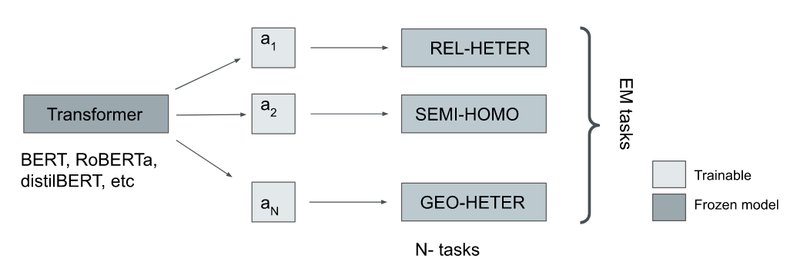

# AdapterEM: Pre-trained Language Model Adaptation fo Generalized Entity Matching using Adapter-tuning

abstract 

Entity Matching (EM) involves identifying different data representations referring to the same entity from multiple data sources and is typically formulated as a binary classification problem. It is a challenging problem in data integration due to the heterogeneity of data representations. State-of-the-art solutions have adopted NLP techniques based on pre-trained language models (PrLMs) via the fine-tuning paradigm, however, sequential fine-tuning of overparameterized PrLMs can lead to catastrophic forgetting, especially in low-resource scenarios. In this study, we propose a parameter-efficient paradigm for fine-tuning PrLMs based on adapters, small neural networks encapsulated between layers of a PrLM, by optimizing only the adapter and classifier weights while the PrLM parameters are frozen. Adapter-based methods have been successfully applied to multilingual speech problems achieving promising results, however, the effectiveness of these methods when applied to EM is not yet well understood, particularly for generalized EM with heterogeneous data. Furthermore, we explore using (i) pre-trained adapters and (ii) invertible adapters to capture token-level language representations and demonstrate their benefits for transfer learning on the generalized EM benchmark. Our results show that our solution achieves comparable or superior performance to full-scale PrLM fine-tuning and prompt-tuning baselines while utilizing a significantly smaller computational footprint $\approx 13\%$ of the PrLM parameters.

Repository contains code for [AdapterEM: Pre-trained Language Model Adaptation fo Generalized Entity Matching using Adapter-tuning]([link](https://dl.acm.org/doi/10.1145/3589462.3589498)) accepted in IDEAS 2023.



## Requirements

- Python 3.9.7
- torch 1.12.1+cu113 
- torchvision 0.13.1+cu113
- Adapter Transformers 4.24.0
- scikit-learn 1.1.2

 run 
```
python install -r requirements.txt
```

## Datasets

We use eight real-world benchmark datasets with different structures from [Machamp](https://github.com/megagonlabs/machamp) and [Geo-ER](https://github.com/PasqualeTurin/Geo-ER) also used in the 
[PromptEM paper](https://arxiv.org/abs/2207.04802).

## Fine-tuning

To train and evaluate AdapterEM with a randomly initialized adapter;

```
bash semi-homo.sh
```

To train a invertible language adapter using mask language modeling (probability p=0.20), navigate to `masked_language_modeling`.
After training, language adapter is saved to `adapters` directory, then run;

```
bash semi-homo_tapt-20.sh
```
or if langauge adapter trained for p=40\% then,


```
bash semi-homo_tapt-40.sh
```


The meaning of the flags:

- `--model_name_or_path`: the name or local path of the pre-trained language model. e.g. `bert-base-uncased`
- `--data_name`: the name of the dataset. options: `[rel-heter, rel-text, semi-heter, semi-homo, semi-rel, semi-text-c,semi-text-w, geo-heter, all]`
- `--adapter_setup`: specify the configuration i.e., blank adapter or pre-trained e.g task_only
- `--adapter_size`: bottleneck size e.g `2, 4,..`
- `--k`: the proportion of training data used. e.g. `0.1 or 1.0`
- `--num_iter`: the number of iterations. e.g. `1`
- `--text_summarize`: the flag to enable text summarization in entity serialization.
- `--add_token`: the flag to add special token in entity serialization.
- `--max_length`:  the maximum length (in number of tokens) for the inputs to the transformer model. e.g. `512`
- `--n`: the number of epochs for model training. e.g. `30`
- `--batch_size`: batch size. e.g. `32`
- `--lr`: learning rate. e.g.`1e-4`

## Training snli language adapter

```
bash train_slni_adapter.sh

```   


Shield: [![CC BY 4.0][cc-by-shield]][cc-by]

This work is licensed under a
[Creative Commons Attribution 4.0 International License][cc-by].

[![CC BY 4.0][cc-by-image]][cc-by]

[cc-by]: http://creativecommons.org/licenses/by/4.0/
[cc-by-image]: https://i.creativecommons.org/l/by/4.0/88x31.png
[cc-by-shield]: https://img.shields.io/badge/License-CC%20BY%204.0-lightgrey.svg


