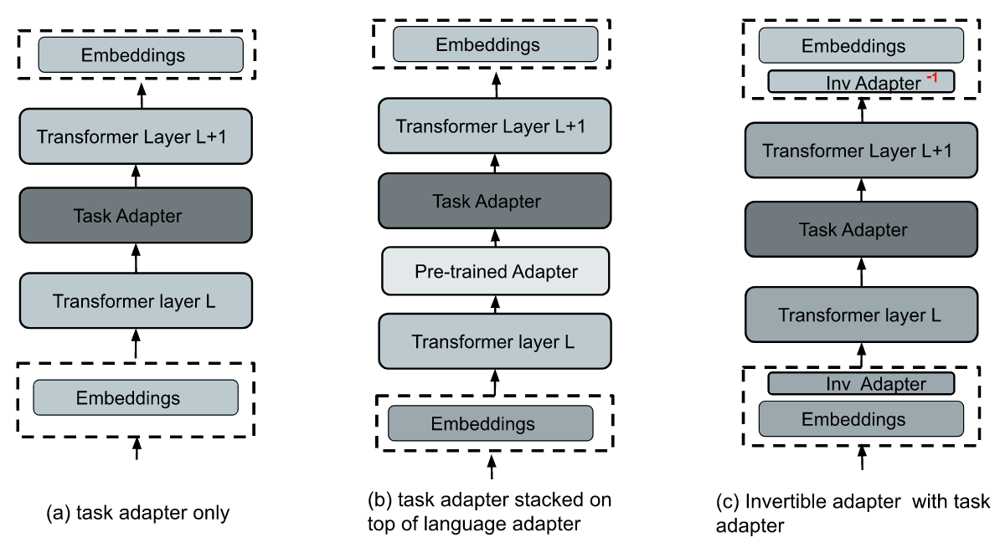

# AdapterEM: Pre-trained Language Model Adaptation fo Generalized Entity Matching using Adapter-tuning

abstract 

Entity Matching (EM) involves identifying different data representations referring to the same entity from multiple data sources and is typically formulated as a binary classification problem. It is a challenging problem in data integration due to the heterogeneity of data representations. State-of-the-art solutions have adopted NLP techniques based on word embedding technology and pre-trained language models (PrLMs) via the fine-tuning paradigm yielding successful results in EM, however, sequential fine-tuning of overparameterized PrLMs can require costly parameter updates resulting in catastrophic forgetting, especially in low-resource scenarios. Our study proposes a parameter-efficient paradigm for fine-tuning PrLMs based on adapters, small neural networks introduced between the layers of a PrLM to mitigate problems introduced by regular fine-tuning, where only the adapter weights are updated via backpropagation while the PrLM parameters are frozen. Adapter-based methods have been successfully applied to multilingual speech problems achieving promising results, however, the effectiveness of these methods when applied to EM is not yet well understood, in particular for generalized EM with heterogeneous data. We show that by utilizing less than 13\% of the parameters with a significantly smaller computational footprint, our solution mitigates catastrophic forgetting and matches or outperforms regular fine-tuning and prompt-tuning baselines.

Paper [AdapterEM: Pre-trained Language Model Adaptation fo Generalized Entity Matching using Adapter-tuning](link).



# Masked Language Model Training for Language Inv Adapters


## Datasets

We use eight real-world benchmark datasets with different structures from [Machamp](https://github.com/megagonlabs/machamp) and [Geo-ER](https://github.com/PasqualeTurin/Geo-ER) also used in the 
[PromptEM paper](https://arxiv.org/abs/2207.04802).

## training invertible adapters

During MLM training, the underlying model will be fixed while the adapters will be fine-tuned on the unlabelled texts. For 20 percent masking run;

```
bash mlm_train-20.sh
```

To train an adapter using (probability p=0.40), run;

```
bash mlm_train-40.sh.
```

After training, language adapter is saved to `adapters` directory. You can also modify these parameters in the respective `bash scripts`


The meaning of the flags:

- `--model_name_or_path`: the name or local path of the pre-trained language model. e.g. `bert-base-uncased`
- `--data_name`: the name of the dataset. options: `[rel-heter, rel-text, semi-heter, semi-homo, semi-rel, semi-text-c,semi-text-w, geo-heter, all]`
- `--k`: the proportion of training data used. e.g. `default: 1.0`
- `--text_summarize`: the flag to enable text summarization in entity serialization (default: False).
- `--add_token`: the flag to add special token in entity serialization (default: True).
- `--max_length`:  the maximum length (in number of tokens) for the inputs to the transformer model. e.g. `512`
- `--n`: the number of epochs for model training. e.g. `3`
- `--batch_size`: batch size. e.g. `32`
- `--lr`: learning rate. e.g.`2e-4`
- `--mlm_prob`: masked language modeling probability for BERT e.g `0.2,0.4`


## License

